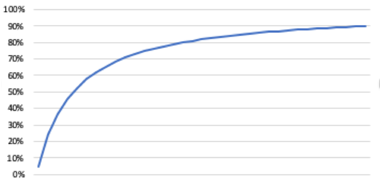

## 红包雨生成规则
1. 落10-15S 用户最多领取15个红包
2. 上下限后台运营人员配置 [L0, L1]
3. 使用时自动选中可用红包
4. 翻倍规则: 由红包上下限[R0, R1]映射到配置上下限[L0,L1]并采用递增曲线. 

如:SIGMOD 

S(x)=1/(1+power(e,-x))

C=5
C可以调整取值范围[3,6]
取上图[-C,0]

> 1. 将R映射至[-C,0] 
> 
> x=R\*C/(R2-R1)-C  
> $$x=\frac{R*C}{R_2-R_1}-C$$
> 
>  2.通过S(x)映射至[L0,L1]
>
> L=(L1-L0)\*2\*S(x)
> $$L=(L_1-L_0)*2*S(x)$$
> 

也可以考虑用幂函数, 指数函数, 反三角函数等, 但是没必要, 最多幂函数就行了.

## 假数据规则
基于假数据要求:

1. 初期增长高
2. 永远不会100%
3. 实际销售增加, 百分比增加
4. 随时间有变化

可使用如下曲线

参数 | 说明 | 建议 
---- | ---- | ---
Count | 购买个数
t | 开始时间 | 秒数/60 float
p1 | 分子常量 | 1 (可调)
p2 | 分母常量 | 30 (可调) 

x = count+t

f(x)=(p1+x)/(p2+x)

注意要随机加抖动,避免各产品太像
